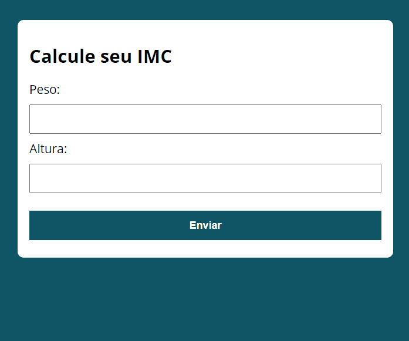

📚 Praticando um pouco de JavaScript com esse site de Cálculo de IMC.

➡️ [Acesse a página clicando aqui](https://gabrielcostarep.github.io/Calculadora-IMC) ⬅️

 

  

## 🚀 Tecnologias

Este projeto foi desenvolvido com as seguintes tecnologias:

- ✔️ JavaScript
- ✔️ HTML
- ✔️ CSS

 

Feito por Gabriel Costa 👋🏾 [Veja meu Linkedin](https://www.linkedin.com/in/gabrielcostadev/)
